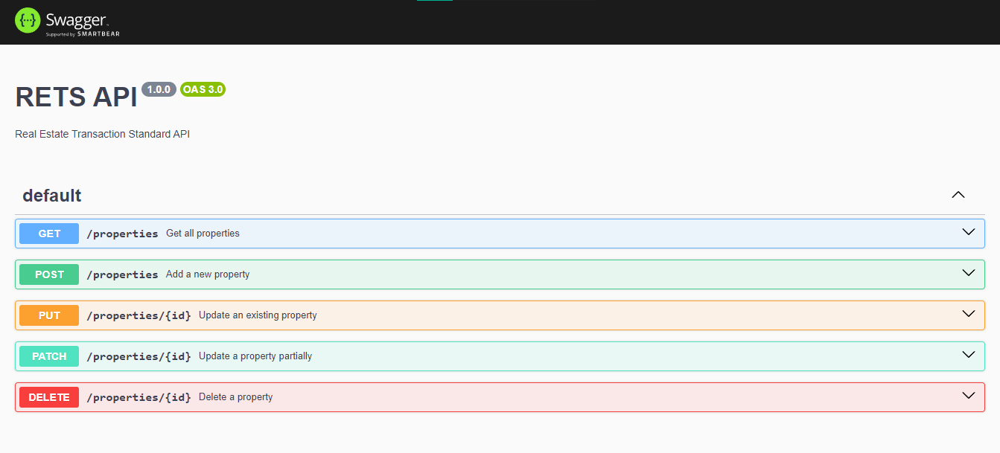

# RETS API  - Hospital General 1.0.1

Real Estate Transaction Standard API (RETS API) es un proyecto que proporciona una interfaz para interactuar con una base de datos de propiedades inmobiliarias. Permite realizar operaciones CRUD (Crear, Leer, Actualizar, Eliminar) en una base de datos MySQL a través de una API RESTful construida con Node.js y Express, y documentada con Swagger.

## Descripción del Proyecto

El objetivo del proyecto es facilitar la gestión de datos inmobiliarios mediante una API RESTful. Los usuarios pueden acceder a la documentación de la API a través de Swagger, lo que facilita la comprensión y el uso de los endpoints disponibles.



## Requisitos del Proyecto

Para ejecutar este proyecto, necesitas tener instalados los siguientes requisitos:

| Requisito     | Versión Requerida          |
|---------------|----------------------------|
| Node.js       | 14.x o superior            |
| npm           | 6.x o superior             |
| MySQL         | 8.x o superior             |

## Pasos para Ejecutar el Proyecto

### 1. Clonar el Repositorio

```bash
git clone https://github.com/AntonioValentinSayago/api-rest-node-swagger
cd tu-repositorio
```

### 2. Instalar Dependencias
```bash
npm install
```

### 3. Configurar la Base de Datos
Asegúrate de tener MySQL instalado y corriendo. Luego, crea una base de datos y configura las credenciales en un archivo .env.
```bash
CREATE DATABASE rets_db;
USE rets_db;
CREATE TABLE properties (
    id INT AUTO_INCREMENT PRIMARY KEY,
    address VARCHAR(255) NOT NULL,
    price DECIMAL(10, 2) NOT NULL,
    bedrooms INT NOT NULL,
    bathrooms INT NOT NULL,
    listing_date DATE NOT NULL
);
```
Configurar Variables de Entorno

Crea un archivo .env en la raíz del proyecto con el siguiente contenido:
```bash
DB_HOST=localhost
DB_USER=root
DB_PASSWORD=tu_password
DB_NAME=rets_db

```
### 4. Insertar Datos de Ejemplo
Ejecuta las siguientes instrucciones SQL para insertar datos de ejemplo en la tabla properties:
```bash
INSERT INTO properties (address, price, bedrooms, bathrooms, listing_date) VALUES
('123 Main St, Anytown, USA', 250000.00, 3, 2, '2023-01-15'),
('456 Oak St, Othertown, USA', 320000.00, 4, 3, '2023-02-20');
```

### 5. Ejecutar el Proyecto
```bash
npm start

```
